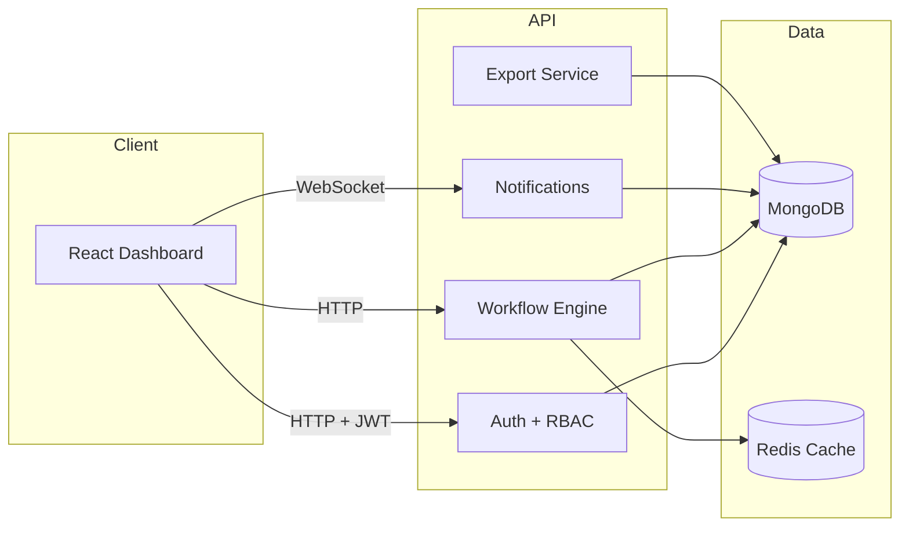

# Flowmaster Platform

## Problem Statement
Teams rely on multiple tools to automate workflows, route approvals, and keep stakeholders informed. The fragmentation creates delays, missing handoffs, and manual reporting. Flowmaster is a multi-user workflow automation SaaS prototype that unifies triggers, processing, actions, and real-time visibility for small teams.

## Architecture Overview



## Features
- Authentication with JWT access + refresh tokens
- Role-based access control (owner, admin, member, viewer)
- Multi-user workspaces (private + shared)
- Workflow automation engine with async worker
- Real-time updates via WebSocket (socket.io)
- Export workflow runs as CSV
- Caching layer (Redis optional, in-memory fallback)
- Global error handling and logging

## Tech Decisions
- Node.js + Express for the API server
- MongoDB (Mongoose) for flexible workflow data
- Socket.io for real-time notifications
- React + React Query for the frontend
- Redis as optional performance cache

## Setup Instructions

### 1) Install dependencies
```bash
npm install
npm install -w backend
npm install -w frontend
```

### 2) Start MongoDB and Redis
```bash
docker compose up -d
```

### 3) Configure environment
Copy and update the backend env file:
```bash
cp backend/.env.example backend/.env
```

### 4) Run the apps
```bash
npm run dev
```

Frontend: http://localhost:5173
Backend: http://localhost:4000

## API Overview
- POST /api/auth/register
- POST /api/auth/login
- POST /api/auth/refresh
- POST /api/auth/logout
- GET /api/workspaces
- POST /api/workspaces
- POST /api/workspaces/:workspaceId/members
- GET /api/workflows/workspace/:workspaceId
- POST /api/workflows/workspace/:workspaceId
- POST /api/workflows/:workflowId/trigger
- GET /api/notifications
- GET /api/exports/workflow-runs?workspaceId=...

## Workflow Automation Engine
Each workflow follows a simple pipeline:

Trigger -> Processing -> Action -> Result

When a workflow is triggered, a pending run is created. The worker polls and processes runs asynchronously, then emits notifications to connected clients.

## Time Investment
This prototype was designed to showcase senior-level architecture patterns, real-time updates, and production-ready structure in a compact footprint.